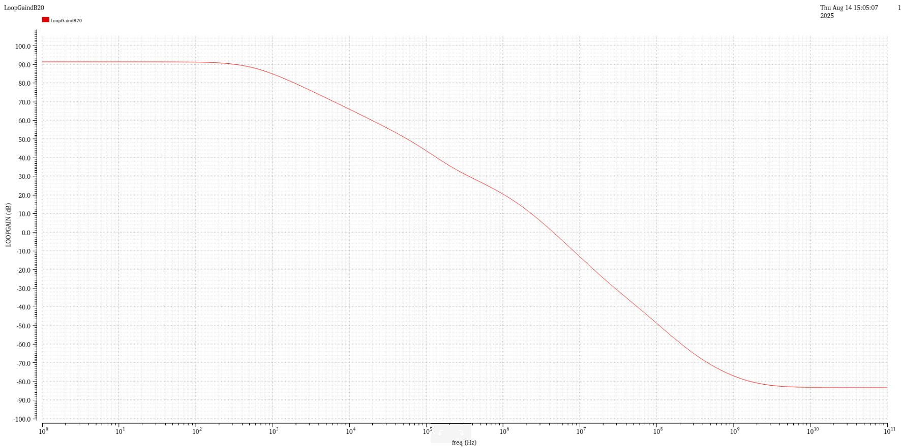
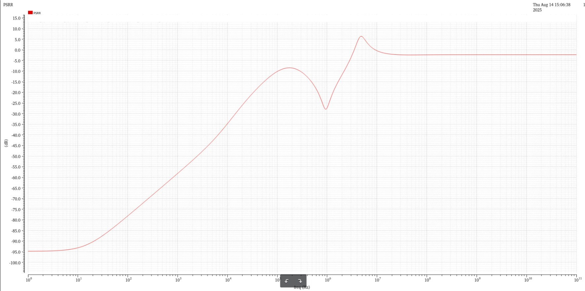
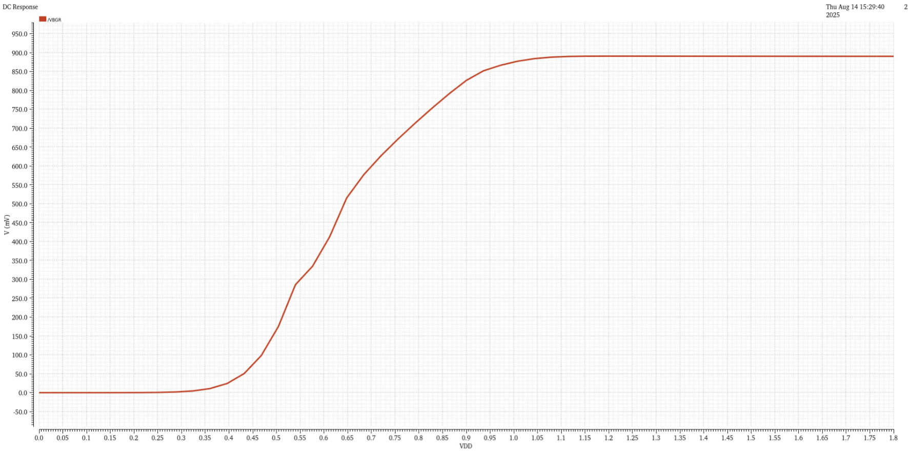
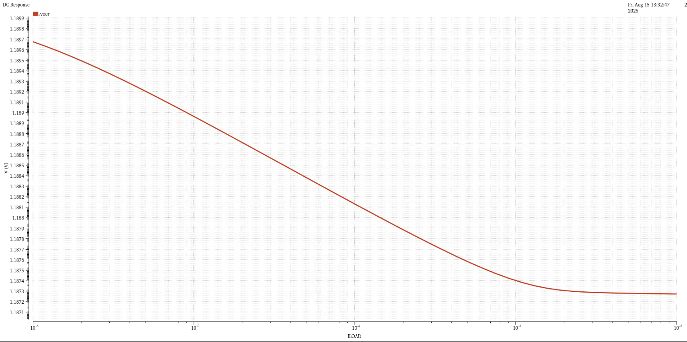

#  LOW QUIESCENT CURRENT LOW DROP OUT VOLTAGE LINEAR REGULATOR

**Authors:** Trong Hieu Tran (Hira) 

**Organization:** 
National Chung Cheng University
College of Engineering
Department of Electrical Engineering

**Technology/Process:** 180nm

**Tool:** Cadence Virtuoso

Project Duration: 15th July, 2025 to 20th August, 2025

**Date (lastest upadated):** 16th August, 2025

# Low Drop-Out Voltage Regulator with Bandgap Reference (BGR)

## Overall Specification of Low Drop-Out Voltage Linear Regulator

Based on the information provided in the Process Design Kit (PDK) documentation,  
the detailed specifications for this project are compiled and summarized in Table 1.  
These specifications define the fundamental design targets and operational constraints for the bandgap reference (BGR) circuit.  
They serve as the primary reference point to ensure that all subsequent design phases — including circuit-level implementation,  
pre-layout and post-layout simulations, and final layout design — remain fully compliant with the overall system requirements.  
By adhering strictly to these specifications, the design process ensures performance reliability, process compatibility, and seamless integration within the complete system-on-chip (SoC) environment.

Throughout the design cycle, every subcircuit and functional block is conceived, developed, and optimized with continuous reference to these overarching specifications.  
This systematic approach guarantees consistency across design stages, minimizes the risk of parameter drift, and enhances the likelihood of first-silicon success.

The primary performance objectives of this project focus on two critical parameters: *low quiescent current consumption* and *high Power Supply Rejection Ratio (PSRR)*.  
Achieving a low quiescent current is vital for maximizing overall power efficiency, particularly in portable and battery-powered applications where reduced static current directly translates into extended operational lifetime.  
Conversely, maintaining a high PSRR is essential for ensuring that the output reference voltage remains unaffected by fluctuations, ripple, or noise present on the supply rail.  
This capability is especially important when powering high-precision analog and mixed-signal circuits, where even small disturbances can degrade performance.

These two objectives — low quiescent current and high PSRR — form the central pillars of the design strategy.  
They directly influence the selection of circuit architectures, the choice of device topologies, and the implementation of optimization techniques,  
such as gain boosting and supply noise filtering, to meet the stringent performance requirements specified in the PDK documentation.

### Table 1 – Specification of LDO (On-chip Load Capacitance)

| Parameter         | Min   | Typ   | Max   | Unit |
|-------------------|-------|-------|-------|------|
| VDD               | 1.71  | 1.80  | 1.89  | V    |
| Temperature       | -40   | 25    | 70    | °C   |
| VOUT              | 1.188 | 1.20  | 1.212 | V    |
| VREF              | 0.855 | 0.90  | 0.945 | V    |
| Load current      | 1 µ   | 1 m   | 10 m  | A    |
| Load current step | 1     | –     | –     | µs   |
| Cload             | 300 p | 400 p | 500 p | F    |
| Iq                | –     | 10 µ  | 15 µ  | A    |
| PSR (DC)          | –     | –     | -55   | dB   |
| PSR (1 kHz)       | –     | –     | -30   | dB   |
| Function          | \* Startup, curvature compensation, trimming for process variation, power-down switches |  |  |  |

### Table 2 – PVT Corner Settings

| Type  | P (Process)         | V (Voltage)      | T (Temperature) | Total |
|-------|---------------------|------------------|-----------------|-------|
| MOS   | SS, SF, FS, FF, TT  | 1.71, 1.8, 1.89  | -40, 25, 70     |       |
| BJT   | SS, FF, TT          | –                | –               |       |
| RES   | SS, FF, TT          | –                | –               |       |
| CAP   | SS, FF, TT          | –                | –               |       |
| Number of corners | 135    | 3                | 3               | 1215  |

## Research and Design of Bandgap Reference Circuit

### Specification

The bandgap (BGR) block is one of the most critical components of the LDO, as it generates a reference voltage $V_{\text{ref}}$ that is insensitive to temperature and process variations for the subsequent error amplifier (EA).  
In addition, the BGR in this thesis is designed to provide a precise reference current $I_{\text{ref}}$, enabling accurate biasing and consistent performance across process, voltage, and temperature (PVT) corners.

### Table 3 – Bandgap Reference Specification

| Parameter  | Min   | Typ   | Max   | Unit | Note                      |
|-----------|-------|-------|-------|------|---------------------------|
| VDD       | 1.71  | 1.80  | 1.89  | V    |                           |
| Temp      | -40   | 25    | 70    | °C   |                           |
| VBG       | 0.855 | 0.90  | 0.945 | V    | Post-trim, 6-sigma        |
| Temp Co.  | –     | 100   | –     | ppm  |                           |
| Iq        | –     | 1 µ   | 1.5 µ | A    |                           |
| PSR (DC)  | –     | –     | -60   | dB   |                           |
| PSR (10 kHz) | –  | –     | -30   | dB   |                           |
| Function  | \* Startup, curvature compensation, trimming for process variation, power-down switches | | | |

### Block Diagram

A key design objective of this project is to achieve exceptionally low quiescent current consumption, which is particularly important for battery-powered and energy-efficient systems.  
To accomplish this goal, the circuit design strategically utilizes resistors with a high sheet resistance value.  
By increasing the resistance per unit area, the static current drawn through these elements is significantly reduced, thereby lowering the total standby power consumption of the bandgap reference (BGR) circuit.

However, the adoption of high-resistance components introduces a notable design trade-off.  
Specifically, the value of resistor $R_7$ becomes more sensitive to variations in the semiconductor manufacturing process, as well as to temperature-induced fluctuations in resistivity.  
These variations can lead to substantial deviations in the output reference voltage across different process corners and over the operating temperature range.  
Such deviations, if left uncompensated, would undermine the accuracy and stability of the reference voltage, potentially impacting the performance of the entire system that relies on this BGR.

To address this challenge and improve the robustness of the design, the proposed topology integrates two additional subsystems:  
a curvature compensation network and a PSRR (Power Supply Rejection Ratio) enhancement circuit.

- The curvature compensation system is specifically engineered to counteract the inherent non-linear temperature dependence of the reference voltage, minimizing the temperature coefficient.
- The PSRR enhancement network is incorporated to strengthen the circuit’s immunity to noise and ripple originating from the supply voltage.

Together, these two subsystems ensure that the BGR not only meets the low-power requirement but also delivers high performance in terms of voltage stability, temperature insensitivity, and supply noise rejection.

#### Proposed Bandgap Topology

  
*Figure: Proposed Bandgap Reference Topology*

  
*Figure: General Schematic of BGR*

### Error Amplifier

#### Table 4 – Comparison of Operational Amplifier Topologies

| Topology       | Gain   | Output Swing | Speed   | Power Dissipation | Noise  |
|----------------|--------|--------------|---------|-------------------|--------|
| Telescopic     | Medium | Medium       | Highest | Low               | Low    |
| Folded-Cascode | Medium | Medium       | High    | Medium            | Medium |
| Two-Stage      | High   | Highest      | Low     | Medium            | Low    |
| Gain-Boosted   | High   | Medium       | Medium  | High              | Medium |

Based on the comparative analysis summarized above,  
the operational amplifier (OA) topologies that best meet the design objectives for a low-power bandgap reference (BGR) are the telescopic and folded-cascode configurations.  
Both topologies are well-regarded in precision analog design due to their high gain potential and low noise characteristics.  

In this work, all operational amplifiers are implemented using the folded-cascode topology, mainly due to:

- Superior intrinsic gain compared to telescopic OA
- Better voltage headroom at low supply voltages
- Flexible choice of input device type (PMOS/NMOS) to meet common-mode requirements

Two-stage OA topologies can provide larger output swing but introduce two dominant poles, which can complicate frequency compensation and reduce phase margin.  
By contrast, the folded-cascode configuration naturally yields a single dominant pole, simplifying stability design and enhancing robustness across PVT corners.

  
*Figure: General Schematic of EA in BGR*

  
*Figure: Detail schematic of EA core and self-bias circuit*

  
*Figure: Open-loop Gain of EA in BGR*

  
*Figure: PSRR of EA in BGR*

From post-measurement results, the voltage difference $\Delta V_{BE}$ was found to be approximately $550 \, \text{mV}$, which directly sets the common-mode input voltage of the EA.  
Due to this relatively low common-mode level, a PMOS input differential pair is selected to provide adequate headroom and maintain high gain.

#### Table 6 – EA in BGR: Measured Parameters

| Parameter        | Result | Unit |
|------------------|--------|------|
| Open-loop Gain   | 89.95  | dB   |
| PSRR @ DC        | -83.06 | dB   |
| PSRR @ 10 kHz    | -34.71 | dB   |

### PSRR Enhancement

In the proposed topology, two primary techniques are employed to improve the PSRR of the BGR:

1. **Gain-boosting system** to enhance PSRR at low and mid frequencies by increasing output impedance.  
2. **Low-pass filter** to attenuate high-frequency noise components present at the output node.

#### Gain-Boosting System

The small-signal output impedance of the BGR, seen from the output reference node, is:

$$
R_{\text{out}} = r_{ds_{M7}} \parallel R_7
$$

The corresponding output voltage is:

$$
V_{\text{out}} = \frac{-PSRR_{A1} \cdot V_{DD}}{g_{m_{M7}} \cdot R_{\text{out}}} + \frac{V_{DD}}{g_{m_{M7}} \cdot R_7}
$$

If $r_{ds_{M7}} \gg R_7$:

$$
V_{\text{out}} \approx \frac{V_{DD} \cdot (1 - PSRR_{A1})}{g_{m_{M7}} \cdot R_{\text{out}}}
$$

With gain boosting, the effective output resistance becomes:

$$
R_{\text{out}} = (r_{ds_{M7}} \parallel R_7) (1 + A_2)
$$

and

$$
\frac{V_{\text{out}}}{V_{DD}} = \frac{1 - PSRR_{A1}}{g_{m_{M7}} \cdot R_{\text{out}} \cdot (1 + A_2)}
$$

Structurally, the gain-boosting amplifier is similar to the EA, but uses an NMOS differential input pair due to a higher required common-mode input voltage (~0.9 V).

  
*Figure: Gain-boosting Amplifier Schematic*

  
*Figure: Gain-boosting Amplifier Core*

  
*Figure: Open-loop Gain of Gain-Boosting Amplifier*

  
*Figure: PSRR of Gain-Boosting Amplifier*

#### Table 8 – Gain-Boosting Amplifier: Measured Parameters

| Parameter        | Result | Unit |
|------------------|--------|------|
| Open-loop Gain   | 92.02  | dB   |
| PSRR @ DC        | -85.74 | dB   |
| PSRR @ 10 kHz    | -38.10 | dB   |

#### Low-Pass Filter

To further improve PSRR at high frequencies, a low-pass filter is added after the output voltage across $R_7$.  
The cutoff frequency is:

$$
f_c = \frac{1}{R \cdot C}
$$

#### Table 9 – RC Low-Pass Filter Components

| Device | Unit Value          | Multiplier | Segment | Total Value      |
|--------|---------------------|------------|---------|------------------|
| R      | 321.45 kΩ           | 1          | 50      | 16.0725 MΩ       |
| C      | 951.6 fF            | 100        | 1       | 9.516 pF         |

  
*Figure: Low-Pass Filter Schematic*

### Start-up Circuit

The BGR has two operating regions:

- **Active region** – circuit biased, producing stable reference voltage  
- **No-power region** – circuit inactive, zero output

Without a start-up circuit, the BGR can remain stuck in the no-power region due to a metastable equilibrium at zero current.  
A dedicated start-up circuit forces the BGR into the active region at power-up and then becomes inactive in steady state to avoid affecting accuracy.

  
*Figure: Start-up Circuit Schematic*

At initial power-up:

- Node OUTEA (drain of M8) ≈ $V_{DD}$  
- Node PREVBGR (gate of M7) ≈ 0 V → M7 is off  
- No current flows through $R_{21}$, so gate of M6 is at $V_{DD}$ and M6 conducts strongly, discharging OUTEA

As $V_{\text{BGR}}$ increases, M7 turns on, gate of M6 falls from $V_{DD}$, and M6 current approaches zero.  
$R_{21}$ is chosen large to limit unnecessary current during normal operation.

  
*Figure: $V_{\text{BGR}}$ – $V_{DD}$ Graph*

  
*Figure: Transient Simulation at Power-Up*

The PMOS current mirror in the BGR uses two-finger devices with $W/L = 500 \, \text{nm} / 20 \, \mu\text{m}$ to improve matching and PSRR.  
PMOS device $M_{13}$ supplies the bias current for the LDO error amplifier.

  
*Figure: Current Mirror of BGR Circuit*

### Trimming Circuit

The trimming circuit fine-tunes the reference voltage to compensate for process and temperature variations after fabrication.  
From PVT measurements:

$$
V_{\text{LDO}} = 1.2086 \, \text{V} \pm 13.23 \, \text{mV} \quad (6\sigma)
$$

Allowed variation: < 1% of nominal:

$$
\Delta V_{\text{max, 6σ}} = 12 \, \text{mV}
$$

Required number of LSBs:

$$
N_{\text{LSB}} = \frac{13.23 \, \text{mV} \cdot 2}{12 \, \text{mV} \cdot 2} \approx 2 \ \text{(LSB)}
$$

Voltage step (1 LSB):

$$
LSB = \frac{13.23 \, \text{mV} \cdot 2}{2} = 13.23 \, \text{mV}
$$

Maximum trimmed error:

$$
\Delta V_{\text{ref}} = 13.23 \, \text{mV} \cdot \frac{2}{3} = 8.82 \, \text{mV}
$$

  
*Figure: Trimming Circuit*

  
*Figure: Post-Trimming Simulation*

### Curvature Compensation

To generate $\Delta V_{BE}$, BJTs are sized with different emitter areas.  
In this design:

- Left BJT multiplier: 1  
- Right BJT multiplier: 8  

This also simplifies layout into a uniform $9 \times 9$ array.

To reduce higher-order temperature effects, a curvature compensation network is used.  
From the topology:

$$
I_{\text{Ref}} = I_{\text{PTAT}} + I_{\text{CTAT}} - 2 I_{\text{non-linear}}
$$

  
*Figure: BGR Core and Curvature Compensation Branch*

### Comparison and Summary of Bandgap Reference

The PTAT–CTAT compensation point is designed at the nominal operating temperature to minimize variation under typical conditions.

  
  

  
  

  
  

#### Table 10 – BGR PVT Results

| Parameter          | Spec          | TT       | SS       | FF       | FS       | SF       | Unit |
|--------------------|---------------|----------|----------|----------|----------|----------|------|
| Number of Corners  | 1215          | 243      | 243      | 243      | 243      | 243      |      |
| VBG                | 0.855–0.945   | 0.8928   | 0.8923   | 0.8963   | 0.8933   | 0.8944   | V    |
| Temp Co.           | 100           | 45.5     | 53.66    | 90.12    | 42.5     | 48.66    | ppm  |
| Iq                 | 1 µ           | 976 n    | 955 n    | 997.5 n  | 977.1 n  | 976.2 n  | A    |
| PSR (DC)           | -60           | -76.15   | -79.66   | -68.77   | -84.35   | -68.85   | dB   |
| PSR @ 10 kHz       | -30           | -67.01   | -66.19   | -67.59   | -66.93   | -66.88   | dB   |
| Function           | Startup, curvature compensation, trimming for process variation, power-down switches | | | | | | |

#### Table 11 – BGR Comparison with Other Works

| Parameter           | This Work | [6] 2025 | [7] 2025 | [8] 2025 | [9] 2025 | [10] 2025 | Unit  |
|---------------------|-----------|----------|----------|----------|----------|-----------|-------|
| Process             | \multicolumn{7}{c|}{180 nm}                            |
| Supply              | 1.8       | 1.65–5.5 | 1.8      | 1.5–1.8  | 0.9      | 1.5–2.5   | V     |
| VBG                 | 0.8928    | 0.807    | 1.8      | 0.58     | 0.524    | 0.9       | V     |
| Temp Co.            | 45.5      | 65       | 13.54    | 0.86     | 44.7     | 0.638     | ppm   |
| Power               | 1.7568 µ  | 180.85 µ | 83.9 µ   | –        | 131 n    | –         | W     |
| PSR (DC)            | -76.15    | -47      | –        | –        | –        | –         | dB    |
| PSR (High freq, Hz) | -67.01@10k| –        | –        | -70@100  | -44@100  | –         | dB    |
| Temperature Range   | -40–70    | -40–125  | -40–125  | -40–125  | -35–130  | -40–150   | °C    |

## Research and Design of Low Drop-Out Voltage Regulator Circuit

### Block Diagram and Pole Analysis

The LDO circuit consists of two primary blocks:

- Error amplifier (EA)  
- Pass device  

For a **PMOS-based LDO**:

- Pole $P_1$ at the gate of the pass device:

  $$
  f_{P1} = -\frac{1}{2\pi R_{\text{OTA}} C_{\text{gate}}}
  $$

- Pole $P_2$ at the output:

  $$
  f_{P2} = -\frac{1}{2\pi R_L C_L} = -\frac{I_{\text{load}}}{2\pi V_{\text{out}} C_L}
  $$

For an **NMOS-based LDO**:

- Pole $P_1$ (EA output):

  $$
  f_{P1} = -\frac{1}{2\pi R_{\text{OTA}} C_{\text{gate}}}
  $$

- Pole $P_2$ at regulator output:

  $$
  f_{P2} = -\frac{g_{m,\text{NMOS}}}{2\pi C_L} = -\frac{\sqrt{2 \beta I_{\text{load}}}}{2\pi C_L}
  $$

Because NMOS devices have larger $\beta$, the NMOS-based $P_2$ is at a much higher frequency, especially in capacitor-less designs (small $C_L$), allowing $P_1$ to be the dominant pole.

  
*Figure: Comparison of Load Drive Capability of (a) NMOS and (b) PMOS Pass Devices*

According to the comparison in Table 12, NMOS and PMOS are the most suitable pass devices for low quiescent current with high load current.  
PMOS has lower dropout voltage, so it is selected in this work.

  
*Figure: LDO Block Diagram*

  
*Figure: Common Pass Device Types*

#### Table 12 – Pass Device Comparison

| Parameter          | NMOS          | NPN            | PNP            | PMOS           | Darlington        |
|--------------------|---------------|----------------|----------------|----------------|-------------------|
| $I_{0\text{-max}}$ | Medium        | High           | High           | Medium         | High              |
| $I_{\text{static}}$| Low           | Medium         | Medium         | Low            | Medium            |
| $V_{\text{drop-out}}$ | $V_{\text{sat}} + V_{\text{gs}}$ | $V_{\text{sat}} + V_{\text{be}}$ | $V_{\text{ec-sat}}$ | $V_{\text{sd-sat}}$ | $V_{\text{sat}} + 2V_{\text{be}}$ |
| Speed              | Medium        | Fast           | Slow           | Medium         | Fast              |

  
*Figure: LDO Schematic*

### Error Amplifier and Frequency Compensation

The EA regulates the output by ensuring the feedback voltage equals the reference (0.9 V).  
For better PSRR with a PMOS pass device, an NMOS differential input pair is used in the EA.

  
  

  

To enhance phase margin, **Miller compensation** is used:

- A compensation capacitor between first-stage output and second-stage input  
- Introduces an LHP zero (phase boost)  
- Splits poles (dominant pole at low frequency, non-dominant poles at higher frequencies)  
- Improves stability and transient response across PVT and load conditions

  

  

#### Table 14 – LDO EA: Measured Parameters

| Parameter        | Result | Unit |
|------------------|--------|------|
| Open-loop Gain   | 88.71  | dB   |
| PSRR @ DC        | -77.49 | dB   |
| PSRR @ 10 kHz    | -86.84 | dB   |

### Comparison and Summary of LDO

  
  

The LDO is stable when the phase margin satisfies $ \text{PM} > 45^\circ $, as confirmed by loop-gain and phase simulations.

  

  

Line regulation:

$$
\text{Line Regulation} 
= \left| \frac{\Delta V_{\text{out}}}{\Delta V_{DD}} \right| 
= \left| \frac{1.187425 - 1.1873925}{1.75 - 1.785} \right| 
= 0.09\%
$$

  
  
  

Due to the sufficiently high phase margin, the system shows excellent transient stability with no observable overshoot or undershoot.  
The LDO reference system satisfies design requirements and aligns with practical industry norms, providing a solid basis for future silicon implementation.

Future optimization targets include:

- Further reducing power consumption  
- Providing multiple reference-voltage levels  
- Extending the usable supply-voltage range  

to enhance applicability in integrated-circuit design.

#### Table 15 – LDO PVT Results

| Parameter          | Spec          | TT       | SS       | FF       | FS       | SF       | Unit |
|--------------------|---------------|----------|----------|----------|----------|----------|------|
| Number of Corners  | 3645          | 729      | 729      | 729      | 729      | 729      |      |
| VOUT               | 1.188–1.212   | 1.191    | 1.191    | 1.196    | 1.192    | 1.195    | V    |
| Iq                 | 10            | 5.075    | 4.917    | 5.37     | 5.138    | 5.099    | µA   |
| PSR (DC)           | -55           | -71.79   | -64.63   | -57.52   | -63.18   | -56.68   | dB   |
| PSR @ 1 kHz        | -30           | -41.29   | -40.25   | -41.01   | -41.32   | -39.97   | dB   |
| Function           | Startup, trimming for process variation, power-down switches | | | | | | |

#### Table 16 – LDO Comparison with Other Works

| Parameter           | This Work | [11] 2024 | [12] 2025 | [13] 2024 | [14] 2024 | [15] 2024 | Unit |
|---------------------|-----------|-----------|-----------|-----------|-----------|-----------|------|
| Process             | 180nm                       |
| Vin                 | 1.8       | 1.4–1.8   | 2.3–20    | 1.55      | –         | 0.55–1.8  | V    |
| Load Range          | 1 µ–10 m  | 350 m     | 500 m     | 20 m      | 100 m     | 0.95 m    | A    |
| Vout                | 1.191     | 1.2–1.6   | 0.1–19.7  | 1.5       | –         | 0.5–0.8   | V    |
| Iq                  | 5.075 µ   | 380 m     | 2 m       | 24 µ      | 57 µ      | 15–20 n   | A    |
| PSR (DC)            | -71.79    | –         | –         | –         | –         | –         | dB   |
| PSR (High freq)     | -41.29@1k | –         | -106@1k   | -56@1k    | –         | –         | dB   |
| Line Regulation     | 0.09      | 0.45      | 0.0035    | –         | –         | 0.97      | %    |
| Vripple             | 0         | 30–55 m   | –         | –         | –         | 475 m     | V    |

The LDO has been investigated, designed, and successfully simulated.  
Results show that:

- Output voltages meet targets from $-40^\circ\text{C}$ to $70^\circ\text{C}$  
- Operation is robust across TT, FF, SS, SF, and FS process corners  

A summary table of key performance metrics highlights that the proposed design is competitive relative to prior work and provides a strong foundation for further CMOS LDO implementations.

## References

1. **Behzad Razavi**, *Design of Analog CMOS Integrated Circuits*, McGraw-Hill Education.

2. **R. Jacob Baker**, *CMOS Circuit Design, Layout and Simulation*, IEEE Press.

3. **Behzad Razavi**, *The Design of a Low-Voltage Bandgap Reference*, IEEE Solid-State Circuits Magazine, Summer 2021.

4. **Behzad Razavi**, *The Design of an LDO Regulator*, IEEE Solid-State Circuits Magazine, Spring 2022.

5. **Amr I. Kamel; Ahmed Saad; Lee Seng Siong**, *A High Wide-Band PSRR and Fast Start-Up Current-Mode Bandgap Reference in 130 nm CMOS Technology*, 2016 IEEE International Symposium on Circuits and Systems (ISCAS).

6. **Lukas Šalavėjus; Vaidotas Barzdėnas; Aleksandr Vasjanov; Tzung-Je Lee**, *Sub-1 V Bandgap Reference Design Using TSMC 180 nm BCD Process*, IEEE.

7. **Joel Georgeous; Lutfi Albasha**, *Design and Implementation of a Bandgap Voltage Reference (1.8 V) and a Low Drop-Out Circuit Using 180 nm BiCMOS Technology*, IEEE.

8. **Emmanuel Amankrah; Patricia Tutuani; Randall Geiger**, *A Hybrid BJT/Subthreshold MOSFET-Based Voltage Reference with a Sub-1 ppm/°C Temperature Coefficient*, IEEE.

9. **Xuanlin Chen; Jiangchao Wu; Bo Wang; Man Kay Law**, *A 0.9 V CMOS Voltage Reference with 0.41% Untrimmed Accuracy and 44.7 ppm/°C TC from −35 °C to 130 °C*, IEEE.

10. **Peng Fu; Xin Pan; Tiedong Cheng; Ziyu Xiao**, *A 0.638 ppm/°C Precision Bandgap Reference with Multi-Segment Current Compensation*, IEEE.

11. **Sayantan Samanta; Joydeep De; Srijit Mishra; Soumik Bandyopadhyay; Swarnil Roy**, *A Transient Enhanced Capacitor-Less 380 mA LDO with 1.2 µA Quiescent Current*, IEEE.

12. **Yun Li; Jiarun Jiang; Pengda Qu; Yue Zhao; Feng Luo; Zhiming Xiao**, *An Ultra-Low Noise and Wide Output Range LDO with BJT Input Stage and Base Current Cancellation Technique*, IEEE.

13. **Michael Sekyere; Degang Chen**, *Low Power, Fully-Integrated Flipped Voltage Follower LDO Using Off-State Non-Linear Circuits for Enhanced Transient Performance (Invited Paper)*, IEEE.

14. **Fanyang Li; Tao Yin; Faxiang Wang; Zhanpeng Yuan**, *A Transient Response Improved Digital LDO with an Approximate CEAG Analog-to-Frequency Domain Converter*, IEEE.

15. **Marco Privitera; Andrea Ballo; Alfio Dario Grasso; Massimo Alioto**, *A 15-nA Quiescent Current Capacitor-Less LDO for Sub-1 V µW-Powered Fully-Harvested Systems*, IEEE.

